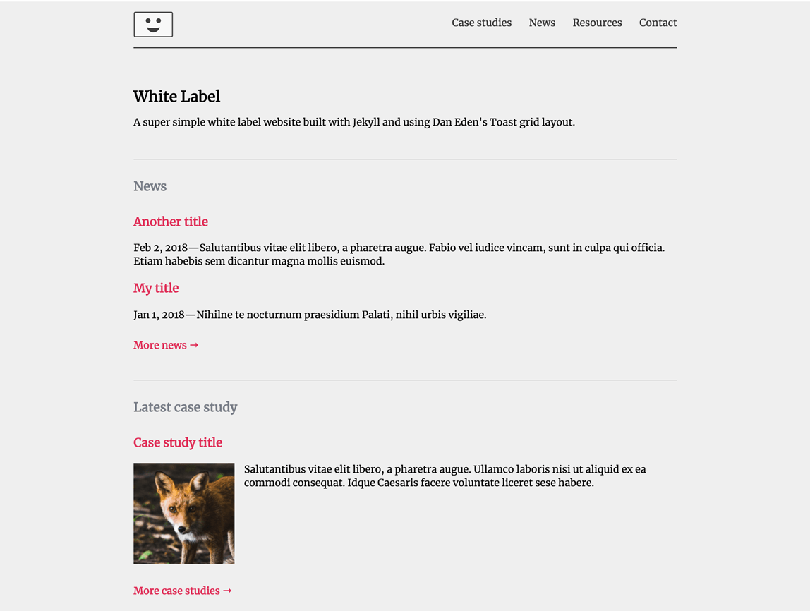

# A super simple white label Jekyll website

This is Jekyll starter site with a few extra features. Served at [https://whitelabel.netlify.com](https://whitelabel.netlify.com/)

## Fancy features

* Uses [Toast](https://daneden.github.io/Toast/), Dan Eden's insane, no nonsense CSS grid
*  Jason Mayes' [Twitter post fetcher](https://github.com/jasonmayes/Twitter-Post-Fetcher)
*  Custom collections: Case studies and Resources
* Markdown plugin
* Gratuitous [wenking](https://tiaanduplessis.github.io/wenk/) from Tiaan du Plessis
* Google map

## Image credits

The fox image is by Andreas Rønningen and the cow photo is by Shane Rounce, both from Unsplash.

## Copyright

This is free. You can do what you like with it.